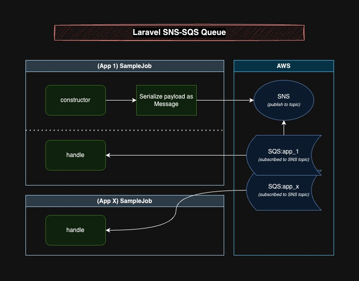

# Laravel SNS-SQS Queue
[](https://packagist.org/packages/acdphp/laravel-sns-sqs-queue)

Fanout Laravel queue jobs with AWS SNS and SQS for microservices communication.



## Installation
1. Install the package
    ```shell
    composer require acdphp/laravel-sns-sqs-queue
    ```

2. Add new queue connection in your `config/queue.php`. *(Similar to default sqs connection but with added `endpoint` and `sns_topic_arn`)*
   ```php
   'connections' => [
      'sns-sqs' => [
         'driver' => 'sns-sqs',
         'key' => env('AWS_ACCESS_KEY_ID'),
         'secret' => env('AWS_SECRET_ACCESS_KEY'),
         'region' => env('AWS_DEFAULT_REGION', 'us-east-1'),
         'prefix' => env('SQS_PREFIX', 'https://sqs.us-east-1.amazonaws.com/your-account-id'),
         'queue' => env('SQS_QUEUE', 'default'),
         'suffix' => env('SQS_SUFFIX'),
         'after_commit' => false,
         'endpoint' => env('AWS_ENDPOINT'),
         'sns_topic_arn' => env('SNS_TOPIC_ARN', 'arn:aws:sns:us-east-1:your-account-id:topic'),
     ],
   ]
   ```
   
3. Usage 
   1. Globally set your `QUEUE_CONNECTION` to `sns-sqs` 
   2. OR Job specific (recommended to only use this for microservice message jobs):
       ```php
       class MicroserviceMessageJob implements ShouldQueue
       {
           use Dispatchable, InteractsWithQueue, Queueable, SerializesModels;

           public function __construct($yourData, $anotherData)
           {
               $this->onConnection('sns-sqs');
           }
      ```

## Notes
- Fanout Jobs must exist in all applications that should handle the message with the same namespace and constructor arguments for it work properly.
- Publishing to SNS uses HTTP/S protocol which is synchronous. This means that your job dispatch will hold off the process until the SNS responds back. Consider using a better technology, for instance, using AMQP (like this [library](https://github.com/vyuldashev/laravel-queue-rabbitmq)) for better performance.

## License
The MIT License (MIT). Please see [License File](LICENSE) for more information.
